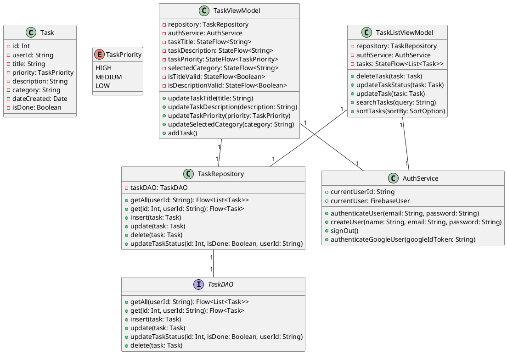

Okay, here's a comprehensive README.md file (including a technical report) for the Tazq project, incorporating the elements you requested:

```markdown
# Tazq: A Family-Friendly Task Management App

## Overview

Tazq is an Android task management application designed to help families organize, assign, and track tasks. Built with Kotlin and Jetpack Compose, Tazq provides a clean and intuitive interface for managing daily activities. The app leverages Firebase for user authentication and data storage, ensuring data synchronization and accessibility across devices.

## Technical Report

### Functionality

Tazq offers the following core functionalities:

*   **User Authentication:**
    *   **Email/Password Authentication:** Users can create accounts and log in using their email address and password.
    *   **Google Sign-In:** Users can authenticate using their Google accounts, simplifying the login process.
*   **Task Management:**
    *   **CRUD Operations:** Users can Create, Read, Update, and Delete tasks.
    *   **Task Details:** Each task includes a title, description, priority level (High, Medium, Low), due date, and category (e.g., Work, Personal, Shopping).
    *   **Task Status:** Users can mark tasks as complete or incomplete.
    *   **Sorting:** Tasks can be sorted by date created, priority, or category.
    *   **Searching:** Users can search for tasks by title or description. (Functionality partially implemented)
*   **Profile Management:**
    *   Users can view their profile information, including their name, email, and profile picture.
    *   Users can update their profile picture.

### 3rd Party and Google APIs Used

*   **Firebase Authentication:** Used for user authentication and management, supporting both email/password and Google Sign-In.
    *   [Firebase Authentication Documentation](https://firebase.google.com/docs/auth)
*   **Firebase Firestore:** Used as a NoSQL cloud database to store task data and user profiles.
    *   [Firebase Firestore Documentation](https://firebase.google.com/docs/firestore)
*   **Room:** Used for local data persistence, caching task data for offline access.
    *   [Room Persistence Library Documentation](https://developer.android.com/training/data-storage/room)
*   **Coil:** Used for image loading and caching, primarily for user profile pictures.
    *   [Coil Documentation](https://coil-kt.github.io/coil/)
*   **Hilt:** Used for dependency injection, simplifying the management of dependencies throughout the application.
    *   [Hilt Documentation](https://developer.android.com/training/dependency-injection/hilt-android)
*   **Jetpack Compose:** Used for building the user interface declaratively.
    *   [Jetpack Compose Documentation](https://developer.android.com/jetpack/compose)

### UML & Class Diagrams

**Simplified Class Diagram:**




### UX/DX Approach

**UX Approach:**

*   **Jetpack Compose:** The app uses Jetpack Compose, a modern declarative UI toolkit for Android. This allows for a more intuitive and efficient way of building user interfaces.
*   **Material Design 3:** The UI adheres to Material Design 3 principles, providing a consistent and visually appealing user experience.
*   **Intuitive Navigation:** The app uses a bottom navigation bar for easy access to core features (Task List, Create Task, Categories, About, Profile).
*   **Clear Feedback:** The app provides feedback to the user through confirmation dialogs (e.g., after creating a task) and visual cues (e.g., strikethrough for completed tasks).

**DX Approach:**

*   **MVVM Architecture:** The app follows the Model-View-ViewModel (MVVM) architectural pattern, separating concerns and improving code testability and maintainability.
*   **Dependency Injection (Hilt):** Hilt is used to manage dependencies, making the code more modular and easier to test.
*   **Kotlin Coroutines:** Coroutines are used for asynchronous operations, such as database and network requests, simplifying code and improving performance.
*   **Firebase SDKs:** The app leverages Firebase SDKs for authentication, database, and potentially other services, streamlining backend integration.
*   **Code Structure:** The codebase is organized into packages based on functionality (e.g., `ui`, `data`, `firebase`, `navigation`), making it easier to navigate and understand.

**Traditional vs. Compose vs. Mix:**

This project primarily adopts the **Compose** approach for building the user interface. Jetpack Compose offers a modern and efficient way to create dynamic and responsive UIs. While there might be some interaction with traditional Android components (e.g., using `Context` or other Android APIs), the core UI is built using Compose.

### Git Approach

*   **Feature Branching:** The commit history indicates the use of feature branches for developing new features (e.g., `feature/splash-screen`, `feature/firebase-auth`, `feature/ui-improvements`). This is a good practice for isolating changes and enabling parallel development.
*   **Main Branch:** The `main` branch appears to be the primary branch for integration.
*   **Commit History:** The project has a commit history, but the messages could be more descriptive.

**Git Repository:**

[https://github.com/marcosogg/tazq_assignmnet2](https://github.com/marcosogg/tazq_assignmnet2)

**Areas for Improvement in Git Practices:**

*   **Descriptive Commit Messages:**  Use more descriptive commit messages to clearly explain the changes made in each commit.
*   **Develop Branch:** Introduce a `develop` branch as the main integration branch for ongoing development.
*   **Release Branches:** Use `release` branches to prepare and manage releases.
*   **Tagged Releases:** Tag specific commits as releases (e.g., v1.0.0, v1.1.0) to track versions.

### Personal Statement

This project provided a valuable opportunity to apply my Android development skills and learn new technologies, particularly Jetpack Compose and Firebase. Building a fully functional task management app from scratch was a challenging but rewarding experience. I gained a deeper understanding of:

*   **Modern Android UI Development:** I gained hands-on experience with Jetpack Compose, learning how to create declarative UIs and manage state effectively.
*   **Firebase Integration:** I learned how to integrate Firebase Authentication and Firestore into an Android app, handling user authentication and data persistence in the cloud.
*   **MVVM Architecture:** I implemented the MVVM pattern, which improved the organization, testability, and maintainability of the codebase.
*   **Room Persistence:** I used Room to provide local data storage, allowing the app to function offline and improving performance.
*   **Dependency Injection:** I utilized Hilt for dependency injection, which simplified the management of dependencies and made the code more modular.

I am particularly proud of the clean and intuitive user interface I was able to create using Jetpack Compose. I believe the app is user-friendly and effectively addresses the core requirements of a task management application.

**Future Improvements:**

If I were to continue working on this project, I would focus on:

*   **Enhanced Search and Filtering:** Implement a robust search functionality that filters tasks based on user input. Add filtering options to allow users to view tasks by category, priority, or completion status.
*   **Image Support for Tasks:** Allow users to add images to tasks, potentially storing these images in Firebase Cloud Storage.
*   **Notifications:** Implement push notifications to remind users of upcoming deadlines or overdue tasks.
*   **Collaboration Features:** Explore the possibility of adding features that allow multiple users to collaborate on shared task lists.
*   **Testing:** Add a comprehensive suite of unit and UI tests to ensure code quality and prevent regressions.
*   **Improved Git Workflow:** Adopt a more structured Git workflow with a `develop` branch, `release` branches, and tagged releases.

### References

*   [Android Developer Documentation](https://developer.android.com/)
*   [Jetpack Compose Documentation](https://developer.android.com/jetpack/compose)
*   [Firebase Documentation](https://firebase.google.com/docs)
*   [Room Persistence Library Documentation](https://developer.android.com/training/data-storage/room)
*   [Coil Documentation](https://coil-kt.github.io/coil/)
*   [Hilt Documentation](https://developer.android.com/training/dependency-injection/hilt-android)
*   [Material Design](https://m3.material.io/)

---
